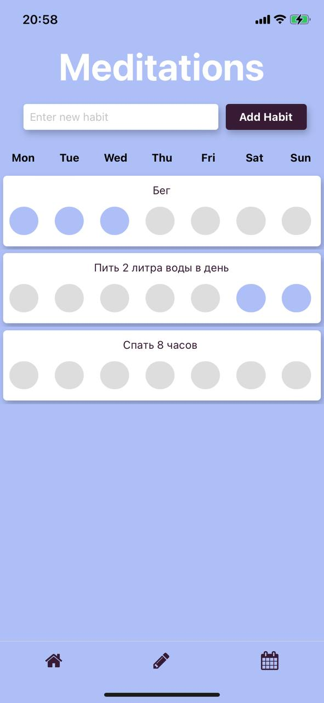

# PeacefulPal 

## Description
Expo react native mobile app for mental health.

## Features
- Registration and authentication 
- Journal 
- Habit tracker
- Breathing exercise
- Pomodoro timer
- Games

## Getting Started

Follow these instructions to set up and run the project on your local machine.

## Prerequisites
- Node.js and npm installed
- Expo CLI installed (`npm install -g expo-cli`)
- Docker installed (for PostgreSQL database with Docker)
- Expo Go app installed on your device (for testing on mobile)

## Setup

1. **Clone the repository:**
   ```bash
   git clone <repository-url>
   cd <project-directory>
   ```

2. **Install dependencies:**
   ```
   npm install
   ```

3. **Run the server:**
   Navigate to the server directory and run the following commands:
   ```
   cd server
   npm install
   node server.js
   ```

4. **Run PostgreSQL with Docker:**
   Navigate to the ./server directory of the project and run:
   ```
   docker-compose up -d
   ```
    Tables will create automatically

5. **Start the Expo development server:**
   ```
   npx expo start 
   ```
   or 
   ```
   npx expo start --tunnel
   ```
   This will start the Expo development server.

6. **Set the API URL:**
   Open the `src/constants/api.js` file and set the appropriate API URL:
   ```javascript
   export const apiUrl = 'https://[YOUR_IP_ADRESS]'; 
   ```

### Running the App

You can run the app on an iOS simulator, Android emulator, or physical device:

- **iOS Simulator:**
  - Make sure you have Xcode installed.
  - Press `i` in the terminal to open the app in the iOS simulator.

- **Android Emulator:**
  - Make sure you have Android Studio installed and an emulator running.
  - Press `a` in the terminal to open the app in the Android emulator.

- **Physical Device:**
  - Download the Expo Go app from the App Store (iOS) or Google Play (Android).
  - Scan the QR code in the Expo DevTools with the Expo Go app.


## Screenshots

### Home, Login, Registration, and Welcome Screen

<p align="center">
  
  
  
  
</p>

### Side Navigation, Breathing Exercise, Habit Tracker, and Journal

<p align="center">
  
  
  
  
</p>

### Meditations, Pomodoro Timer, and Suggestions Focus

<p align="center">
  
  
  
</p>


## Contributing

Contributions are welcome! Please open an issue or submit a pull request for any improvements or bug fixes.


